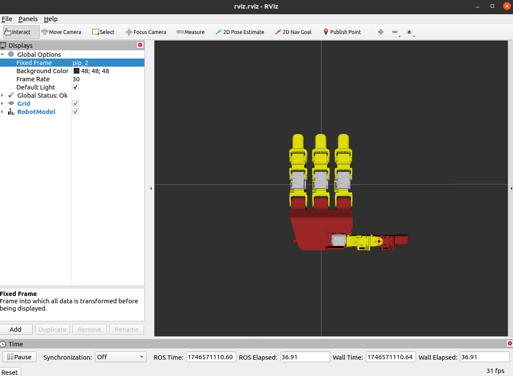
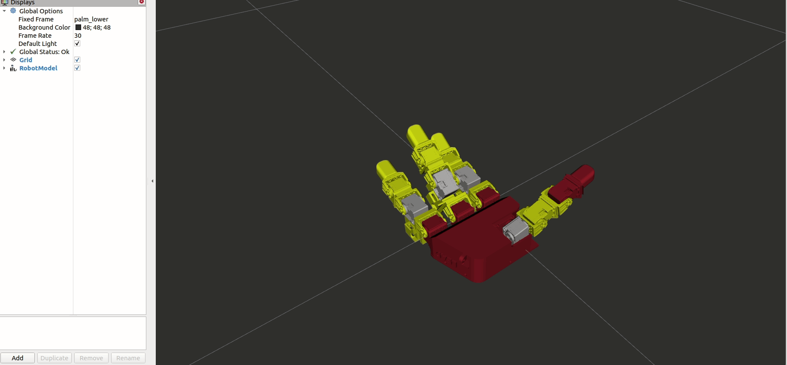

## IRVL Leap Hand ROS Packages
This repository contains the ROS Noetic packages used to control our Leap Hand. They are a modified version of the original authors' ros_module. You can find the original repo at this [link](https://github.com/leap-hand/LEAP_Hand_API). If you find it useful please remember to cite their paper to support the authors' amazing work. 

```
@article{shaw2023leaphand,
  title={LEAP Hand: Low-Cost, Efficient, and Anthropomorphic Hand for Robot Learning},
  author={Shaw, Kenneth and Agarwal, Ananye and Pathak, Deepak},
  journal={Robotics: Science and Systems (RSS)},
  year={2023}
}
```

This repository contains two ROS packages for working with the LEAP Hand: `leap_description` and `leap_hand`. These packages provide URDF models and control interfaces for simulation, visualization, and real-time control of the LEAP Hand within ROS.

- `leap_description`: URDF models for the LEAP Hand (right and left) and visualization tools.
- `leap_hand`: Control interfaces, services, and launch files for interacting with the LEAP Hand.

---

## LEAP Description Package

The `leap_description` package provides URDF models for the LEAP Hand, enabling easy integration into ROS's `robot_description` parameter for simulation and visualization.

### URDF Models

- `leap_right.urdf`: Model for the right LEAP Hand.
- `leap_left.urdf`: Model for the left LEAP Hand.

These files define the hand's kinematic structure and joint limits, making them ideal for loading into ROS. The package includes a launch file, `visualize_robot.launch`, to load a URDF and visualize it in RViz.

#### How to Run

To visualize the right LEAP Hand in RViz, use:

```bash
roslaunch leap_description visualize_robot.launch urdf_file:=leap_right.urdf
```

- Replace `leap_right.urdf` with `leap_left.urdf` for the left hand.


<p align="center">
    
</p>

---

## LEAP Hand Package

The `leap_hand` package provides tools to control the LEAP Hand, with enhancements for simulation compatibility and communication efficiency.

### Controller Features

- **Simulation-Aligned Values**: The controller uses LEAP Hand simulation conventions, where all joints set to 0 means the hand is fully open. This ensures consistency between simulation and physical control. 
- **Joint Limit Enforcement**: Target positions are automatically clipped to the URDF-defined joint limits, preventing invalid commands.

### Position Control

- **Topic**: `/leaphand_node/cmd_leap`
- **Message Type**: `sensor_msgs/JointState`
- **Functionality**: Publish joint positions to this topic to control the hand. The controller enforces URDF joint limits.

### Services

Services for improved state querying efficiency, found that the original code didn't have them completely implemented:

- `/leap_pos_vel`: Returns joint positions and velocities.
- `/leap_pos_vel_effort`: Returns joint positions, velocities, and efforts.

#### Example Service Call

```bash
rosservice call /leap_pos_vel
```

### Launch File

The `leap.launch` file initializes the control node, services, and robot description.

#### How to Run

```bash
roslaunch leap_hand leap.launch urdf_file:=leap_right.urdf
```

- Loads the URDF into `robot_description`.
- Starts the `leaphand_node` for control and services.
- Updates joint states only when services are called, reducing communication issues when reading and setting positions simultaneously.

<p align="center">
    
</p>

---


# Leap Hand API Original Readme:
## Welcome to the LEAP Hand SDK
- Please visit [our website](http://leaphand.com/) for more information about LEAP hand.
#### Software Setup
- Please see the [Python API](https://github.com/leap-hand/LEAP_Hand_API/tree/main/python), [ROS API](https://github.com/leap-hand/LEAP_Hand_API/tree/main/ros_module), [ROS2 API](https://github.com/leap-hand/LEAP_Hand_API/tree/main/ros2_module), [Useful Tools](https://github.com/leap-hand/LEAP_Hand_API/tree/main/useful_tools) folders for software specific details.

#### Hardware Setup
- Connect 5v power to the hand (the dynamixels should light up during boot up.)
- Connect the Micro USB cable to the hand (Do not use too many USB extensions)
- Open [Dynamixel Wizard](https://emanual.robotis.com/docs/en/software/rplus1/dynamixel_wizard/) and find the correct port using the options button and put that in main.py or ros_example.py.  Note, you cannot have Dynamixel wizard open while using the hand's API, the port will be "busy" with the other process.
- On Ubuntu you can find the hand by ID using `/dev/serial/by-id` The ID will stay persistent on reboots.
- We offically support Python and ROS, but other languages are supported by [Dynamixel SDK](https://emanual.robotis.com/docs/en/software/dynamixel/dynamixel_sdk/overview/).
- To improve latency on Ubuntu try these tips.   Configure [USB Latency Settings in Ubuntu](https://emanual.robotis.com/docs/en/software/dynamixel/dynamixel_wizard2/) and the [Dynamixel Python SDK](https://github.com/ROBOTIS-GIT/DynamixelSDK/issues/288) and set the Return Delay Time  (Control Table Register 9 in Dynamixel Wizard) from 250 µs to 0 µs.

#### Functionality
- Leap Node allows you to command joint angles in different scalings.
- You can read position, velocity and current from the hand.  
- Do not query reads too often, going past 90hz for one set of angles or 30hz for all three will slow down the USB communication.
- The default controller follows the PID control, up to the current limit cap. 
- Other controllers including velocity control or current control are supported as per the [motor manual](https://emanual.robotis.com/docs/en/dxl/x/xc330-m288/)
- For Lite, keep the current limit around 300ma.
- For Full, you can raise the current limit up to 550ma.
- If facing a jittery hand, adjust the PID values down.
- If the hand is too weak, adjust the PID values up.

#### Troubleshooting
- If your motor is 90/180/270 Degrees off, the horn is mounted incorrectly on the motor.  Remount it.
- If no motors show up, check that your serial port permissions are correct.
- If some motors are missing, make sure they are IDed corrrectly and are connected to the U2D2.
- If you get "overload error" and the motors are flashing red, then they have overloaded (self-collision etc). It should clear on a power cycle.  If it happens often, lower the current limits in the control code so that it does not happen as often.
- If you get "jittery" motors, try lowering the P and D values, either in the roslaunch file or the python file.
- If you feel the motors are too inaccurate, you can also try raising the P and D values.


#### Useful Tools:
- MANO to LEAP joint angle mapping.
- If you have useful tools you feel the community can benefit from, please make a pull request.
- Please see the code from [Bimanual Dexterity for Complex Tasks](https://bidex-teleop.github.io/) to use Manus gloves with LEAP Hand.
- I can also add tools to this upon request.  :)

#### Support:
- Please contact me at kshaw2@andrew.cmu.edu for any issues.
- This code is made available using an MIT License.
- The CAD files are provided with a CC BY-NC-SA Attribution-NonCommercial-ShareAlike license which allows you to use and build upon our work non-commercially.
- LEAP Hand is provided as-is and without warranty.
- If you use LEAP Hand in an academic setting, please cite our paper:
```
@article{shaw2023leaphand,
  title={LEAP Hand: Low-Cost, Efficient, and Anthropomorphic Hand for Robot Learning},
  author={Shaw, Kenneth and Agarwal, Ananye and Pathak, Deepak},
  journal={Robotics: Science and Systems (RSS)},
  year={2023}
}
```
